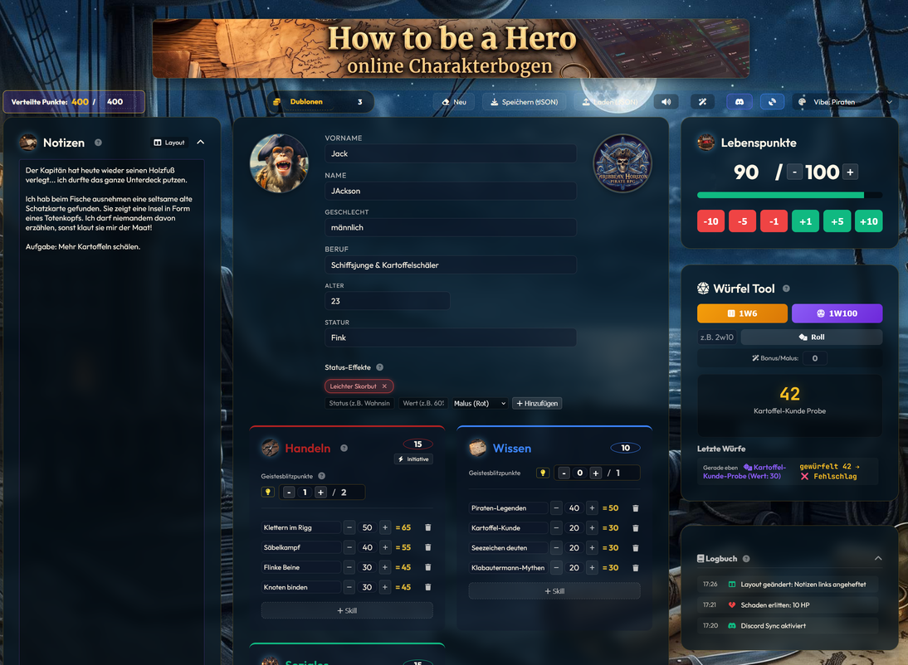
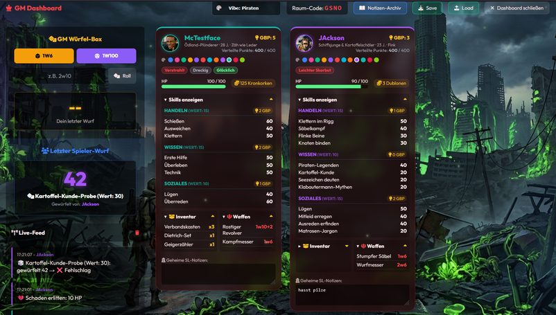

<div align="center">
  
  <h1>🎲 EldaraHQ 🎲</h1>

  <p>
    <strong>EldaraHQ</strong> ist ein interaktiver, regelkonformer und voll animierter Charakterbogen + Live Spielleiter-Dashboard für die Piraten-Kampagne <strong>Eldara</strong> (Hausregelwerk "Version Arrrrr" der Pen & Paper-Gruppe MonkeyFart), gebaut auf Basis des "How to be a Hero" Pen & Paper Systems.<br>
    <em>Ein Community-Projekt für die fantastische Rocket Beans und HTBAH Community! 💖</em>
  </p>

  [](https://opensource.org/licenses/MIT)
  [](https://howtobeahero.de)
</div>

<hr />

<p align="center">
  
  
</p>

## 🌟 Projektübersicht
Moin Moin an alle Bohnen und Pen & Paper Fans! 👋

Dieses Projekt ist aus reiner Leidenschaft für das *How to be a Hero* Regelwerk entstanden und als eigenständiger Ableger speziell für die Piraten-Kampagne Eldara abgespalten worden. Das Ziel war es, eine moderne, digitale Alternative zu statischen PDFs oder Excel-Tabellen zu schaffen, die nicht nur rechnet, sondern auch beim Spielen richtig Spaß macht.
**Das absolute Highlight:** Ein integriertes, serverloses **Multiplayer-System**. Spieler und Spielleiter (SL/GM) können sich in Sekundenschnelle live verbinden – komplett kostenlos, ohne Accounts und ohne Server-Setup!

## 🚀 Live Demo & Nutzung
🔗 **[Hier geht's direkt zur App (Live-Demo)](https://dondavis-vibe.github.io/EldaraHQ/)**

**Kurzanleitung:**
1. Öffne den Link in deinem Browser.
2. Trage deine Werte ein, das Tool übernimmt alle Hintergrundberechnungen.
3. Speichere deinen Charakter als `.json`-Datei lokal ab, um ihn fürs nächste Mal aufzuheben.
4. **Für Multiplayer:** Klicke oben auf das 📡-Icon, gib den Raum-Code deines Spielleiters ein und du bist live verbunden!

---

## 🧙‍♂️ NEU: Live-Sync & GM Dashboard (Multiplayer)
Dank WebRTC (PeerJS) bietet das Tool einen echten Live-Modus. **Keine Registrierung, keine Serverkosten.**

### 👑 Für den Spielleiter (GM):
* **1-Klick Hosting:** Klicke im 📡-Menü auf "Als Spielleiter (GM) hosten". Du erhältst einen kurzen Raum-Code (z.B. `1A2B`), den du deinen Spielern gibst.
* **Live-Dashboard:** Sobald Spieler beitreten, tauchen sie in deinem Dashboard auf. Das Dashboard bietet:
  * **Echtzeit-Spielerkarten:** HP, Profilbild, Skills, Inventar, Waffen, Status und Währung aller Spieler auf einen Blick.
  * **Anti-Cheat System:** Rote Warnung, falls ein Spieler mehr Punkte verteilt hat als sein Budget hergibt (standardmäßig 400, auf dem Bogen einstellbar - das Dashboard übernimmt den eingestellten Wert).
  * **Notizen & Archiv:** Geheime SL-Notizen pro Charakter + allgemeine Kampagnen-Notizen. Das Notizen-Archiv zeigt auch Notizen abwesender Spieler.
  * **Save & Load:** Exportiere und importiere all deine SL-Notizen als JSON-Datei.
  * **Farbcodierung:** Weise jedem Spieler eine eigene Farbe zu für perfekten Überblick.
  * **Live-Logbuch:** Jeder Wurf und jede Aktion der Spieler poppt sofort im GM-Logbuch auf!
  * **GM Würfel-Box:** Eigene Würfel für den SL (1W100, 1W6, Custom), deren Ergebnisse (inkl. Konfetti bei Krits!) lokal angezeigt werden.
  * **🎲 Zufallsgenerator:** SL-Vorbereitungswerkzeug im Dashboard - Namen, NSC (inkl. optionalem Eldara-Wesen mit passender Eigenschaft), Orte, magische Gegenstände, Begägnungen und Gerüchte würfeln. Ergebnisse lassen sich per Klick in die SL-Notizen übernehmen oder (bei Gegenständen) direkt versteckt in die Tischmitte legen. Rein lokal beim SL, nichts geht automatisch an Spieler raus.
  * **🗺️ NSC-Liste & Kartentoken:** Eigenes Gedächtnis für Nichtspielercharaktere mit Ort, Haltung, Auffälligkeit & Notizen. Jeder NSC bekommt sein Kartentoken entweder per eigenem Upload oder direkt aus einer mitgelieferten Galerie vorgefertigter Piraten-Portraits gewählt - Größe (in Kartenfeldern) legst du gleich in der Liste fest.
  * **🪄 SL-Eingriff:** Per Knopf in der Spielerkarte einem Charakter direkt Gegenstände, Waffen oder Geld geben und Status-Effekte setzen oder entfernen - auf Wunsch **verdeckt**, also ohne Logbuch-Eintrag oder Hinweis beim Spieler (für Flüche, heimlich zugesteckte Dinge, schleichende Vergiftungen). In deinem Live-Feed steht jeder Eingriff.
  * **🤯 Tischmitte (Loot-Ablage):** Beute (Gegenstände, Waffen, Geld) schon vor der Session anlegen und **versteckt** halten - nur du siehst sie. Findet die Gruppe die Truhe, ein Klick auf *Aufdecken* und die Beute erscheint bei allen Spielern; per *Geben an …* landet etwas direkt bei einem Charakter. Die Tischmitte bleibt in deinem Browser gespeichert.
  * **🎛️ Integriertes Live-Soundboard:** 43 ausgewählte P&P Sounds & Ambient-Tracks (Epic Boss Musik, Taverne, Schießerei uvm.), die der Spielleiter über das Dashboard synchron bei allen Spielern auslösen kann. Inklusive globalem Lautstärke-Slider und weicher "Fade Out"-Funktion!
  * **💡 Pro-Tipp (Integriertes Sound-Mixing):** Da Sounds nicht automatisch stoppen, wenn ein neuer gestartet wird, fungiert das Tool als echter Soundmixer! Der Spielleiter kann zum Beispiel prasselnden Regen als Endlos-Kulisse laufen lassen und *währenddessen* jederzeit eine Schießerei, einen Schrei oder einen Glockenschlag abspielen, ohne dass die Atmosphäre unterbrochen wird.

### 🦸‍♂️ Für die Spieler:
Einfach den 4-stelligen Code des Spielleiters eingeben und auf "Beitreten" klicken. Ab jetzt werden alle eure Würfe, Lebenspunkte-Updates und Inventar-Änderungen live auf den Monitor des Spielleiters synchronisiert.

**👥 Gruppe:** Rechts zwischen Würfel-Tool und Logbuch siehst du deine Mitspieler - Name, Lebenspunkte und Status-Effekte, live. Mehr bewusst nicht; Skills, Inventar und Notizen der anderen bleiben privat.

**🤯 Tischmitte:** Deckt der Spielleiter Beute auf, klappt auf deinem Bogen die Tischmitte auf. *Nehmen* legt den Gegenstand in dein Inventar (Waffen zu den Waffen, Geld in die Kasse) - greifen zwei gleichzeitig zu, bekommt ihn nur einer. Umgekehrt kannst du eigene Sachen in die Mitte legen, um sie einem Mitspieler zu geben.

**🔊 Eigener Lautstärkeregler:** Neben dem Sound-Schalter in der Symbolleiste sitzt ein Regler für **deine** Lautstärke. Er legt sich als Gesamtlautstärke über den Pegel des Spielleiters, statt ihn zu ersetzen – dessen Mischung bleibt also erhalten (leiser Regen unter einem lauten Schuss), du bestimmst nur, wie laut das Ganze bei dir ankommt. Gilt auch für deine eigenen Würfel- und Treffer-Sounds. Die Einstellung bleibt auf deinem Gerät und wandert nicht in deine Charakter-JSON.

### 🤖 Optional: Discord Webhook Sync (Für alle sichtbar)
Wenn ihr wollt, dass **auch alle Spieler** untereinander die Würfe sehen (z.B. wenn ihr in einem Voice-Call seid), könnt ihr zusätzlich zum Live-Dashboard die native Discord-Integration nutzen:
1. Der Spielleiter erstellt im Textkanal eures Discord-Servers einen **Webhook**.
2. Er kopiert die Webhook-URL und teilt sie mit den Spielern.
3. Die Spieler fügen die URL oben im Tool bei Discord Sync ein.
4. **Ergebnis:** Jeder Wurf poppt sofort live im Discord-Chat auf – mit dem Charakter-Namen als Absender und schicken Emojis!

---

## ⚙️ Core Features (Regelkonform)
Wir haben großen Wert darauf gelegt, die Mechaniken so exakt wie möglich nach dem offiziellen Regelwerk abzubilden:
- **Vollautomatisierung:** Basiswerte (Handeln, Wissen, Soziales), Geistesblitzpunkte (GBP) und Skill-Boni werden automatisch berechnet.
- **1-Klick Proben & Initiative:** Klicke direkt auf deine Skills, Basiswerte oder den **Initiative-Button** (`1W10 + Handeln`), um blitzschnell zu würfeln.
- **Dynamische Krits:** Kritische Erfolge (die ersten 10% des Skillwerts) und Patzer (ab 90 + 10% des Skillwerts, siehe Regelwerk S.21) werden dynamisch anhand deines genauen Werts berechnet (inkl. Konfetti & Sounds!). Je besser die Fähigkeit, desto größer der Krit- und desto kleiner der Patzer-Bereich.
- **HP & Status:** Flexibel anpassbare Status-Effekte (Bonus/Malus) und eine dramatische **visuelle HP-Warnung** (rotes Pulsieren), sobald dein Charakter auf ≤ 10 Lebenspunkte fällt.
- **Smartes Würfel-Tool:** Jeder Wurf wird dokumentiert. Trage im Würfel-Tool schnell einen **Spielleiter-Bonus/Malus** ein, der völlig automatisch in deinen nächsten Wurf eingerechnet wird! 
- **Aktions-Logbuch:** Ein eigenes, aufklappbares Logbuch dokumentiert automatisch chronologisch alle Änderungen an HP, Währung, Inventar, Waffen und Status-Effekten.

---

## 📜 Hausregeln: Eldara – Version Arrrrr
Dieser Fork spielt ausschließlich die Piraten-Kampagne **Eldara** der Pen & Paper-Gruppe **MonkeyFart**, die Eldara schreibt und spielt. Das Regelpaket *Eldara – Version Arrrrr* ist fest eingebaut und wird bei jedem Start automatisch geladen - keine Auswahl, kein Umschalten nötig.

Es bringt mit:
* **Feste Talentliste** mit Beschreibungen, die automatisch auf jeden neuen Charakter übernommen wird (bestehende Punkte bleiben erhalten).
* **Progressive Talentkosten** mit eigenem Punktebudget - „Verteilte Punkte“ zeigt die Kosten entsprechend an.
* **Talentbaum**: Hauptbäume + Wesen wählen, Skills mit Rang- und Skillpunkten lernen, die aus den Talentwerten entstehen; gelernte Skills im Kampf abhaken und ihren Schaden direkt würfeln.
* **Wesen-Effekte** (Boni/Mali) und **Würfeltabellen** (Kochen, Zechen, Orakel ...).

Das Format ist in [DATA_FORMAT.md](DATA_FORMAT.md) beschrieben.

---

## 🏴‍☠️ Piraten-Theme
Der Charakterbogen läuft fest im **Piraten**-Design von Eldara - sanft rollende Ozeanwellen und riesige Kraken-Tentakel als Hintergrund-Effekt (abschaltbar für schwächere Geräte per Klick auf den 🚀).

---

## 🤝 Kompatible Tools & Integrationen
Dieses Tool ist voll kompatibel mit dem **[PnPMaster](https://github.com/Rec0iL/PnPMaster)** – einem umfangreichen GM Tool von **[@Rec0iL](https://github.com/Rec0iL)**. 
Du kannst Charaktere (via `.json` Export) direkt in PnPMaster einlesen und verwalten!

---

## 💻 Für Entwickler & Contribution
Da dieses Tool komplett clientseitig (pure HTML, CSS und Vanilla JS) gebaut ist, kannst du es extrem einfach lokal anpassen. Kein npm, kein webpack, keine Node-Abhängigkeiten!
```bash
# Repo klonen
git clone https://github.com/DonDavis-vibe/EldaraHQ.git

# Einfach in den Ordner wechseln und die index.html im Browser öffnen!
```
Für Infos zur internen Datenstruktur: [DATA_FORMAT.md](DATA_FORMAT.md).

## ⚖️ Rechtliches & Disclaimer (Audio-Assets)
Dieses Tool ist ein rein **nicht-kommerzielles Fan-Projekt**. Einige der im integrierten Soundboard verwendeten Audio-Dateien, Sound-Effekte und Musikstücke sind urheberrechtlich geschütztes Material ihrer jeweiligen Eigentümer (z.B. Rocket Beans Entertainment GmbH oder diverse Künstler/Sound-Libraries).
Sie werden hier ausschließlich im Rahmen eines kostenlosen Community-Projekts für private Rollenspielrunden verwendet. Es ist keine Urheberrechtsverletzung beabsichtigt. Sollten Rechteinhaber die Entfernung bestimmter Audio-Dateien wünschen, werden diese umgehend aus dem Repository entfernt. Bitte öffne in diesem Fall ein Issue auf GitHub.

*(Hinweis: Das "Dungeons & Swagons"-Theme wurde vorsorglich aus dem Soundboard entfernt, bis die Nutzungsrechte geklärt sind.)*

## 📜 Lizenzen
- **Code:** Der Quellcode dieses Tools steht unter der [MIT License](LICENSE).
- **Regelwerk:** Das P&P Regelsystem "How to be a Hero" der *Rocket Beans* Community steht unter der **CC BY-NC-SA 4.0** Lizenz. (Siehe [howtobeahero.de](https://howtobeahero.de/))

## 📇 Impressum & Datenschutz
[Impressum](https://dondavis-vibe.github.io/EldaraHQ/impressum.html) · [Datenschutzerklärung](https://dondavis-vibe.github.io/EldaraHQ/datenschutz.html)
